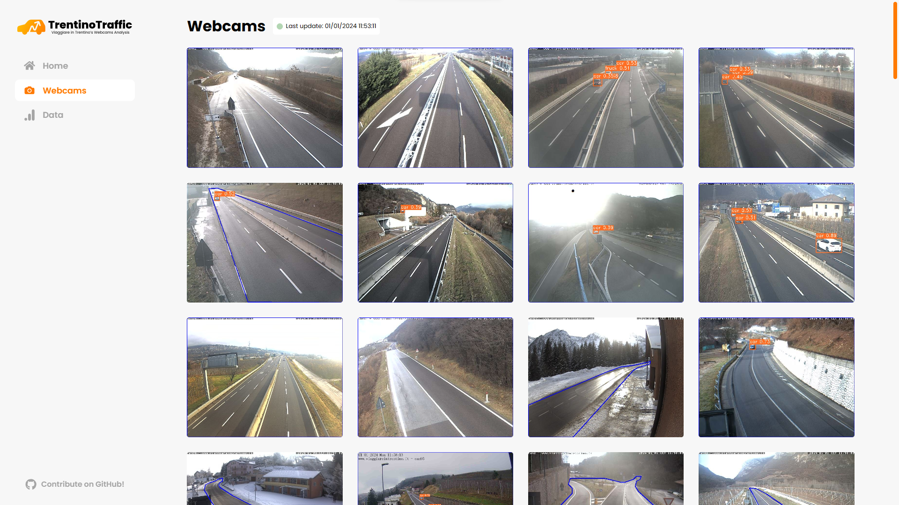

#   TrentinoTraffic
[](https://trentinotraffic.nicolussi.dev)


TrentinoTraffic is a Python script designed for real-time vehicle counting using YOLOv8 and OpenCV. It analyzes webcam frames provided by [viaggiareintrentino.it](https://www.viaggiareintrentino.it/) every 5 minutes, excluding parked vehicles to focus on the dynamic traffic flow. This project is an evolution of the original "[veicoliviaggiareintrentino](https://github.com/napo/veicoliviaggiareintrentino)" by [Maurizio Napolitano](https://github.com/napo).

The script is executed every 5 minutes inside a server and it generates:
- The frames of the webcams with the bounded boxes of the detected vehicles
- A CSV file and a set of data used for plotting the graphs
- A website built with React and Typescript that displays the results in real-time

In this case the types of vehicles that can be recognized are car, truck, bus, motorcycles and train with a confidence index greater than a certain value depending on the type of vehicle.


*Note: The update of the data is performed in a separate and private repository, while the website reflects real-time updates for all data. It's important to mention that the files in this repository, namely `analysis.ipynb` and `trentinotraffic_data.csv`, do not undergo real-time updates. Instead, I will release periodic updates for them. For real-time access, you can download the latest data directly from the website.*

## Results

You can see the live results here: [TrentinoTraffic](https://trentinotraffic.nicolussi.dev)


*NB: the website is optimized also for mobile view*

## Run Locally

Clone the project

```bash
git clone https://github.com/damnicolussi/trentinotraffic.git
```

Go to the project directory

```bash
cd trentinotraffic
```

Install dependencies

```bash
pip -r requirements.txt
```

Run the script

```bash
python app.py
```

### To see the website locally

Go to the website directory

```bash
cd tt-website
```

Install dependencies

```bash
npm install
```

Run the script

```bash
npm run dev
```

Open the website [http://localhost:5173](http://localhost:5173)

## License
This project is licensed under the GNU General Public License v3.0 - see the [LICENSE](LICENSE) file for details.

## Acknowledgements
Original project: "[veicoliviaggiareintrentino](https://github.com/napo/veicoliviaggiareintrentino)" by [Maurizio Napolitano](https://www.github.com/username).

## Get in Touch
For feedback, suggestions, or inquiries, please contact <a href="mailto:damiano@nicolussi.dev">damiano@nicolussi.dev</a>.
